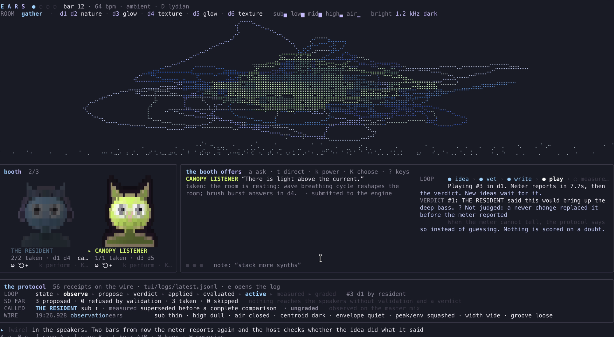

# EARS

**What if Claude could listen?**

A live music set that runs in a terminal. SuperCollider makes the sound, an `ears` synth on the master bus measures
what actually comes out of the speakers, and Claude DJs read those measurements and propose one change at a time.
A human says yes or no. Nothing reaches the speakers without passing validation and a verdict.



## Run it

You need [SuperCollider](https://supercollider.github.io/) (tested with 3.14), Node 20.19+, and the
[Claude Code](https://claude.com/claude-code) CLI signed in. DJs run as `claude -p` with no tools, on your
subscription, with no API key.

```sh
npm install
npm run ears              # the set (ambient by default)
npm run ears:stage        # tmux: your $EDITOR on the left, EARS on the right
npm run ears -- --mute    # silent: the ears still measure, nothing reaches the speakers
npm run ears -- --demo    # visuals only, no SuperCollider
```

`a` asks the booth, `y` / `n` takes or skips an idea, `t` gives a direction, `?` lists every key.

## What's going on

- **The ears.** Every two bars the host measures the mix (sub, low, mid, high, air, brightness, loudness, punch,
  width, groove) and turns it into a listening report: *sub thin · high dull · air closed · centroid dark*.
- **The DJs.** Each DJ is a markdown file in [`tui/djs/`](tui/djs), shaped like a Claude Code skill: a style,
  idioms, things it will never do, and skills (fills, drops, vocals) it can only use once you grant them.
- **Called shots.** Every proposal predicts one measurable thing: *this will bring up the deep bass*. Once it
  lands, the meter reports again and the host grades it: hit, miss, flat, or ungraded when it cannot tell.
- **The veto.** A DJ returns text, not code. The host parses it, validates it, and writes the SuperCollider itself,
  and only after a verdict.

## The protocol

Everything above travels over [**ears-protocol**](https://github.com/joaoviana/ears-protocol): the agent proposes,
the human decides, only the host touches the work. EARS is its reference host and imports its types and vocabulary.
Any agent can join the booth over `localhost:57400`, and the protocol's MCP bridge lets a Claude Code session sit
next to the built-in DJs.

## More

[`tui/README.md`](tui/README.md) is the full manual: every key, mode, the DJ file format, transitions, the evidence
and grading rules, and how everything was checked.

```sh
npm run test:ears         # tests
npm run typecheck:ears
npm run ears:demo-check   # headless UI check, no SuperCollider needed
```

MIT licensed. The nature and texture recordings are CC0; their sources are listed in `tui/samples/*/SOURCES.md`.
